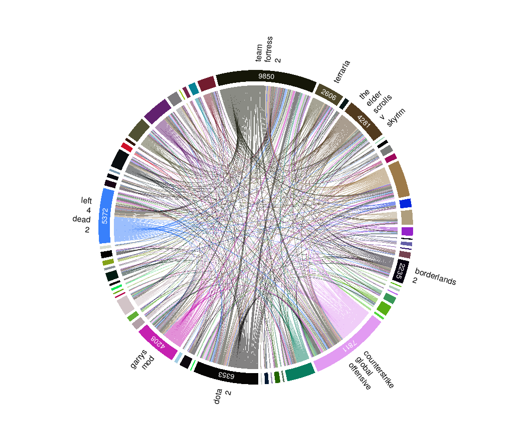

<style>
slides > slide {
  overflow-x: auto !important;
  overflow-y: auto !important;
}
</style>

<style type="text/css">
slides > slide:not(.nobackground):after {
  content: '';
}
</style>

```{r setup, include=FALSE}
load(file = "analisi.RData")
# lista delle librerie utilzzate
library("Rcpp")
library("sets")
library("rmarkdown")
library("circlize")
library('knitr')
library("plyr")
library('dplyr')
library('ggplot2')
library('igraph')
library("purrr")
library("ggraph")
library("tidyr")
library("tidygraph")
library("rlang")
library("netrankr")
library("corrplot")
library("lpSolve")
library("lpSolveAPI")
library("Rglpk")
library("DT")
# sorgenti extra
source("Utils.R")
sourceCpp("NetSimilarity.cpp")
sourceCpp("bitcorr.cpp")
knitr::opts_chunk$set(echo = FALSE, message = FALSE, fig.align='center')
```


## Introduzione

* Che cos'è Steam?
* Perché vale la pena analizzare questi dati?
* Che tipi di relazioni possiamo osservare?
* Cosa possiamo valutare?
* Possiamo usare questi dati per consigliare videogiochi da giocare?

## Librerie utilizzate

```
DT, visNetwork, networkD3
Rcpp, sets, rmarkdown
circlize, knitr, plyr
dplyr, ggplot2, igraph
purrr, ggraph, tidyr
tidygraph, rlang, netrankr
corrplot, lpSolve, lpSolveAPI
Rglpk, DT
```

## Dataset considerati 

I dataset considerati sono in totale tre:

1. [Steam Store Games (Clean dataset)](https://www.kaggle.com/nikdavis/steam-store-games)
2. [Steam Video Games](https://www.kaggle.com/tamber/steam-video-games)
3. [Metacritic all time games stats](https://www.kaggle.com/skateddu/metacritic-all-time-games-stats)

Tutti ottenuti dalla piattaforma Kaggle. 

L'analisi è incentrata sui primi due.

## Dataset 200K o dei giocatori

Mostriamo qui la struttura del primo dataset:

```{r, }
players.data %>% head(20)
```

## Informazioni generali

Con una prima e rapida analisi possiamo calcolare le dimensioni effettive del dataset:

* **12393** giocatori diversi
* **5154** giochi diversi
* **129511** acquisti
* **70489** giochi giocati

Si vede già qui il problema del "backlog".

## Dataset dei Giochi

Molto più ricco è invece il secondo dataset:

```{r}
games.data %>% head(20)
```

Con un totale di **27075** giochi.

# Analisi esplorativa

## Dataset dei giochi giocati

Quali sono i giochi più giocati?

```{r}
games.mostplayed %>% head(20)
```

Nelle prime posizioni sono quasi tutti giochi di Valve.

## distribuzione del tempo di gioco

```{r}
figures.logScale.timeDistribution
```


## distribuzione del numero di giocatori

```{r}
figures.players.distribution
```

## distribuzione del tempo medio di gioco

```{r}
figures.avgTime.distribution
```

## Relazione tra tempo medio di gioco e numero di giocatori

```{r}
figures.players.avgTime
```

In scala logaritmica:

```{r}
figures.players.avgTime.log
```


## Unione dei dataset

* Molte più informazioni disponibili
* Impossibilità di considerare diversi giochi  
* Esempi: serie BioShock e Civilization

## Datare il dataset 200K

Da Kaggle non era possibile avere delle informazioni precise su
quando il dataset 200K fosse stato acquisito. E' possibile datarlo 
utilizzando tre dati:

* La problematica citata sulla serie BioShock
* La presenza del gioco "out there somewhere" (il problema degli Early Access)
* L'assenza di giocatori di Civilization VI

## Datare il dataset 200K

L'assenza di giocatori di Civilization VI risulta statisticamente improbabile:

* Nell'ottobre 2016 vi erano 162310 utenti attivi in contemporanea (circa 1 MLN di copie vendute)
* Gli utenti Steam attivi nel 2018 erano 90 Milioni (e il dato è sempre in crescita)
* secondo queste osservazioni, la probabilità che il non
  campionamento sia casuale è compresa tra 1.265784e-09 e 1.170284e-05

# Recensioni di utenti e recensori

## Apprezzamento dei giochi della serie Civilization

Basato sulla percentuale di valutazioni positive degli utenti Steam:

```{r}
figures.civ.table
```

## Il dataset di Metacritic

* Cos'è metacritic?
* Non solo dati di giochi, non solo dati di giochi per PC.
* Userscore e Metascore

## Il dataset di Metacritic

```{r}
metacritic.data %>% head()
```

## Userscore vs Metascore

```{r}
figures.userscore.vs.metascore
```


## Userscore vs Metascore e Civilization

```{r}
figures.civ.meta.vs.user
```

## Userscore vs apprezzamento Steam e Civilization

```{r}
figures.civ.steam.meta.users
```


## Fit apprezzamento/voto

```{r}
figures.fit
```

```{r}
figures.fit.result
```

## Review Bombing e Delta userscore/metascore

Star Wars Battlefront II è un gioco emblematico per questo fenomeno.

```{r}
figures.swb2.civ
```

## Unione dati metacritic e completezza

Volendo usare sempre i dati di metacritic si perderebbero 1321 giochi e
817 giocatori. Per questo:

* Si accettano valori non definiti
* Viene usato il modello lineare generalizzato calcolato per stimare il Metascore (se assente)

# Altre domande sui dati tabulari

## I giochi vecchi sono i migliori?

```{r}
figures.old1
```

```{r}
figures.old2
```

```{r}
figures.old3
```

```{r}
figures.old4
```

```{r}
figures.old5
```

Essere un gioco Indie ha un impatto positivo o negativo?

```{r}
figures.old6
```

```{r}
figures.old7
```

## Piattaforme di gioco 

```{r}
figures.platforms1
```

```{r}
figures.platforms2
```

## Giochi F2P

Cosa vuol dire veramente "Free to Play"?

```{r}
figures.f2p
```


## Tempo di gioco per genere

Questo è solo un esempio di uso possibile per le Tag.

```{r}
figures.time.genre
```

## Costo medio dell'intrattenimento

```{r}
figures.value1
```

In scala logaritmica:

```{r}
figures.value2
```

# Reti

## Rete giochi giocatori

```{r}
figures.game.player.graph
```

## Distribuzione dei gradi

Segue il modello ad attacco preferenziale di Barabasi-Albert

```{r}
figures.bara
```

## Componente gigante

La ricerca delle componenti connesse restituisce il seguente output, mostrando la presenza della
componente gigante, come atteso.

```
[1] 16
[[1]]
[1] "Dimensione: 3 Numero: 14"

[[2]]
[1] "Dimensione: 4 Numero: 1"

[[3]]
[1] "Dimensione: 13036 Numero: 1"
```

## Rete dell'utenza condivisa

Gli archi mostrano la quantità di utenti che giocano a entrambi i giochi (nodi) adiacenti. 

```{r}
figures.g.g.graph
```

## Visualizzazione con circos

```{r pressure, out.width = '60%'}

```

## Distribuzioni per le varie centralità

```{r}
figures.cent1
```
```{r}
figures.cent2
```
```{r}
figures.cent3
```

## Confronto fra gli ordinamenti

```{r}
figures.ord
```

## Centralità mediata

```{r}
figures.avg.cent
```

## Rete con centralità mediata

```{r}
figures.g.g.avg.c
```

## Potere

```{r}
figures.g.g.pow
```

## Cluster

Fast greedy: (modularità 0.160)

```{r}
figures.cl.fg
```

Louvain: (modularità 0.182)

```{r}
figures.cl.lou
```

Walktrap: (modularità 0.147)

```{r}
figures.cl.wt
```

La modularità basata su uguaglianza di tag è bassa ed è 0.02252084


## Tag e cluster

Secondo il metodo Louvain:

```{r}
figures.tags.lou
```

# Approccio per la raccomandazione dei giochi

## Approccio per la raccomandazione dei giochi

Unione di più aspetti:

* Flusso di giocatori verso altri giochi
* Centralità e potenza nella rete
* Correlazione sul bitset dei generi
* Similarità con altri nodi della rete
* Valutazioni dei critici e stime
* Valutazioni degli utenti
* Costo e tempo medio di gioco
* Dimensione dell'utenza

## Applicazione Shiny

Esempio d'uso

## Conclusione

Molti altri aspetti da valutare:

* Bontà Raccomandazioni
* Classificazione per età
* Categorizzare gli utenti

Risultati:

* Scalabilità
* Approccio parametrico
* Possibilità di integrazione e verifica con ulteriori dati


